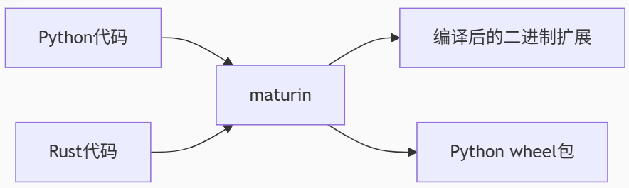

# pyproject.toml

pyproject.toml 是 Python 项目中的核心配置文件，使用 TOML（**Tom's Obvious, Minimal Language**）语法。以下是关键语法规则和常见配置：<br>

# 1. 基本语法

- 键值对 <br>
```sh
key = "value"  # 字符串
number = 42    # 整数
float = 3.14   # 浮点数
boolean = true # 布尔值
```

- 数组 <br>
```sh
dependencies = ["requests", "flask>=2.0.0"]
```

- 多行字符串 <br>

```sh
description = """
This is a
multi-line string.
"""
```

- 表 ： 类似字典 <br>

```sh
[project]
name = "my_package"
version = "0.1.0"
```

- 嵌套表

**使用点好分隔层级** <br>
```sh
[project.urls]
homepage = "https://example.com"
repository = "https://github.com/example/repo"
```

- 数组表(array of tables)

但当需要为每个条目提供多个字段时，就需要使用 数组表，语法是用 [[table-name]] 来声明一个新的表项: <br>

```sh
[tool.poetry]
name = "my-package"

[[tool.poetry.source]]
name = "pypi"
url = "https://pypi.org/simple"

[[tool.poetry.source]]
name = "local-pypi"
url = "https://my-local-pypi.org/simple"
```

这段配置表示项目有两个包索引源，分别是官方 PyPI 和一个本地私有源。


# 2 tool 工具

在 `pyproject.toml` 文件中，`[tool]` 部分是一个通用的配置区域，用于存放各种**第三方工具**的配置。这个设计允许不同的工具在同一个配置文件中存储其特定的设置，而不需要为每个工具创建单独的配置文件（如 `.ini`、`.yaml` 等），从而简化项目配置管理。 <br>


- example:

[tool.uv.sources] 是 uv 工具（由 Astral 开发的高性能 Python 包管理工具）特有的配置项，用于自定义包索引源和覆盖特定包的安装来源。其核心作用是控制依赖包的下载位置，尤其在需要私有包仓库或覆盖特定包来源时非常有用。


```toml
[tool.uv.sources]
pyverbs = [
    { url = "https://oss.mthreads.com/dependency/MGC/epx/torch_musa_build/20250224/pyverbs-39.0-py3-none-any.whl" },
]

[tool.uv]
index-url = "https://nexus.shg1.mthreads.com/repository/pypi-public/simple"
conflicts = [
    [
        { extra = "upstream" },
        { extra = "s4000" },
        { extra = "s5000" },
        { extra = "s5000-megatron" },
    ],
]
```

# 3 构建工具

## 3.1 maturin 构建工具

maturin 是一个构建后端，这是一个专门用于构建 Rust-Python 混合项目的工具。以下是详细解析：

```sh
[build-system]
requires = ["maturin==1.8.3"]  # 构建依赖
build-backend = "maturin"      # 构建后端`

[tool.maturin]
python-source = "***/python"         # 指定 Python 模块的源码位置
features = ["pyo3/extension-module"] # 启用 PyO3 的扩展模块特性
manifest-path = "***/Cargo.toml"     # 指定 Rust 项目的 Cargo.toml 路径
exclude = [                          # 排除不需要打包的文件
    "test_*.py",
    "**/musa/test_data/*",
]
```



**项目结构** <br>

```sh
project-root/
├── mtn-py/
│   ├── python/          <-- Python 源码
│   │   ├── __init__.py
│   │   └── module.py
│   └── Cargo.toml       <-- Rust 配置
├── pyproject.toml       <-- 当前配置文件
└── src/                 <-- Rust 源码 (由 Cargo.toml 指定)
```

**pyo3 介绍** <br>
> PyO3 是一个强大的 Rust 库，专门用于在 Rust 和 Python 之间创建无缝的互操作性。它允许开发者用 Rust 编写 Python 扩展模块，同时提供双向的交互能力。以下是 PyO3 的核心作用、工作原理和关键特性：<br>

> 1. 构建高性能 Python 扩展，
>  - 将 Rust 代码编译为 Python 可直接导入的二进制模块（.so/.pyd/.dylib）;
>  - 替代传统的 C/C++ 扩展，提供内存安全和更高性能：<br>

> 2. 实现双向互操作

> - Python → Rust：将 Rust 函数/结构体暴露为 Python 接口
> - Rust → Python：在 Rust 代码中调用 Python 对象和 API
>
> 3. 类型自动转换
> -  自动处理 Rust 类型（String, Vec, HashMap）和 Python 类型（str, list, dict）的转换

rust-python rust 侧实现 <br>

```rust
use pyo3::prelude::*;

/// 计算斐波那契数列 (高性能 Rust 实现)
#[pyfunction]
fn fibonacci(n: u64) -> u64 {
    match n {
        0 | 1 => n,
        _ => fibonacci(n - 1) + fibonacci(n - 2),
    }
}

/// 将模块注册到 Python
#[pymodule]
fn rust_math(_py: Python, m: &PyModule) -> PyResult<()> {
    m.add_function(wrap_pyfunction!(fibonacci, m)?)?;
    Ok(())
}
```

python 侧调用

```python
import rust_math
print(rust_math.fibonacci(40))  # 比纯 Python 实现快 20x+
```

## 3.2 其他常用构建工具

|工具|语言|特点|
|--- | --- | ---|
|setuptools |	Python | 传统 Python 打包|
|meson -python |	Python/C++ | 通用原生扩展|
|maturin |	Rust-Python	| Rust 生态专属|
|cffi |	C-Python |	C 扩展绑定|

